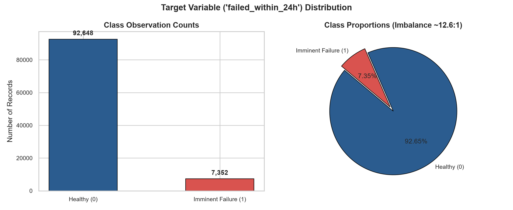
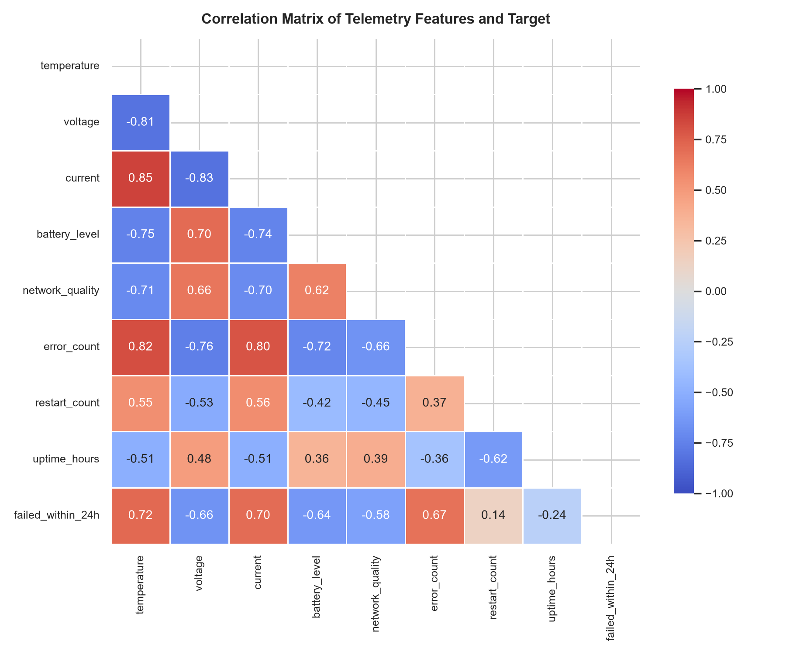
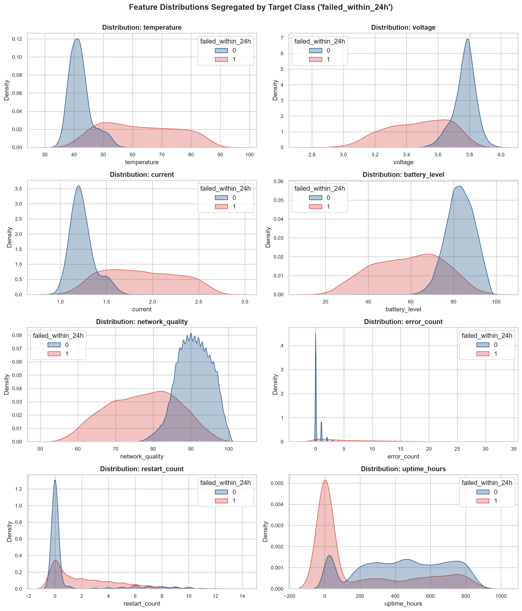
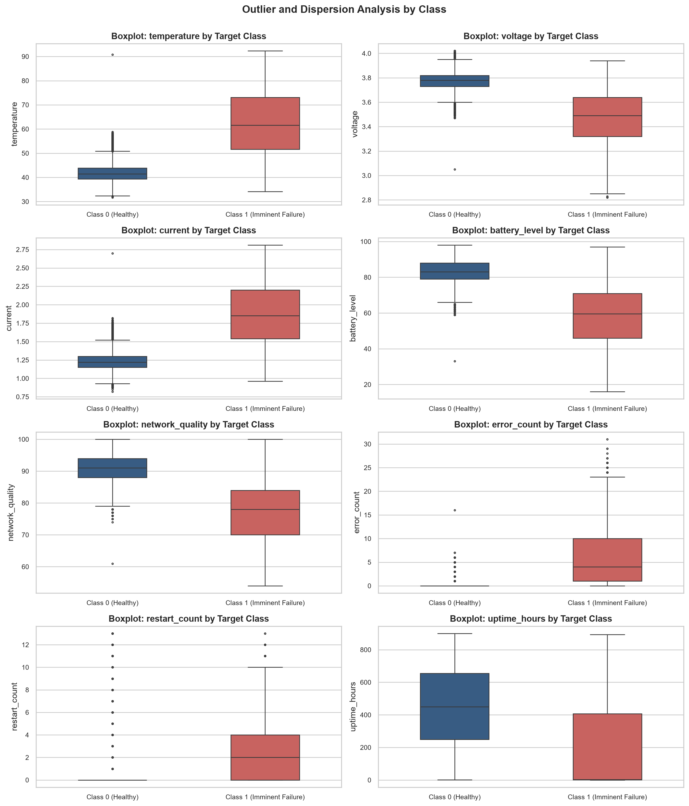
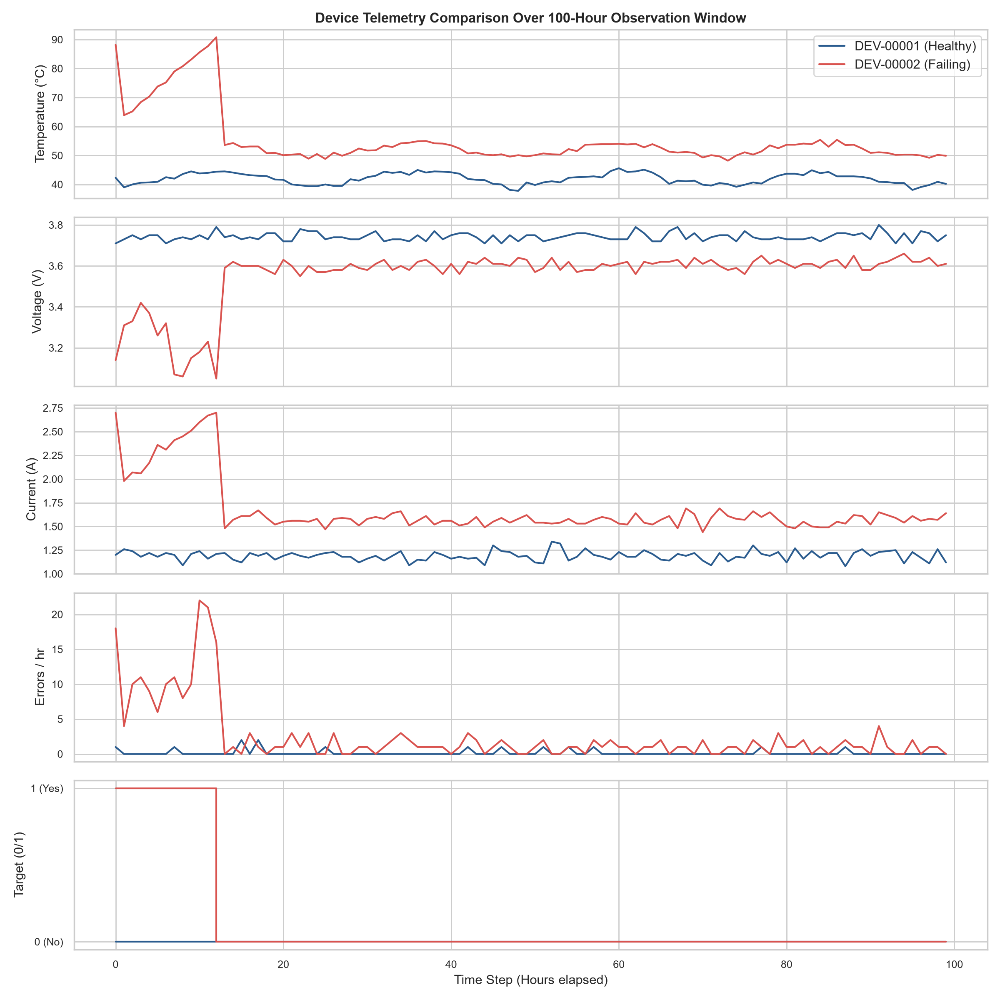
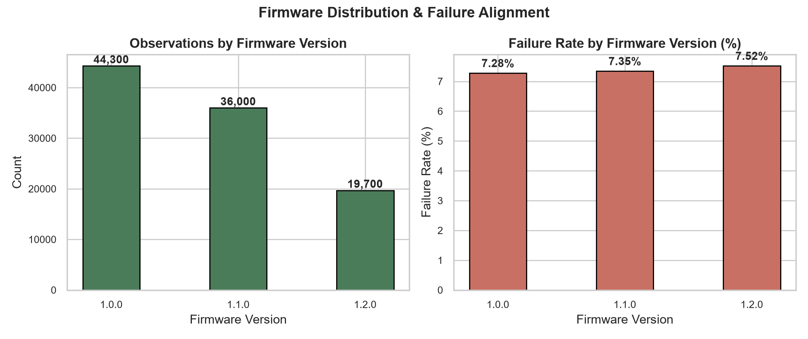

# DataMind: Exploratory Data Analysis (EDA) & Data Profiling Report

**Dataset Path:** `data/sample/device_measurements.csv`  
**Evaluation Scope:** Baseline IoT Telemetry Fleet  
**Generated Date:** 2026-10-01  

---

## 1. Executive Summary: Core EDA Findings

Below are direct answers to the 10 fundamental EDA questions defined in the project specification:

| Question | Finding | Details |
| :--- | :--- | :--- |
| **1. How many devices exist?** | **1,000 devices** | Formatted as `DEV-00001` through `DEV-01000`. |
| **2. How many records exist?** | **100,000 records** | Uniformly 100 observations per device at hourly intervals. |
| **3. What percentage represent failures?** | **7.35%** | 7,352 failure records vs. 92,648 normal records. |
| **4. Are there missing values?** | **0 missing values** | Zero NULL, NaN, empty strings, or infinite values. |
| **5. Which features correlate with failure?** | `temperature` (+0.72), `current` (+0.70), `error_count` (+0.67), `voltage` (-0.66), `battery_level` (-0.64) | Strong physically coherent correlations matching degradation physics. |
| **6. Are there outliers?** | **Yes, physically meaningful** | Outliers in `temperature` (up to 92.3°C), `error_count` (up to 31/hr), and `current` (up to 2.81A) align with device failure states. |
| **7. Is the target imbalanced?** | **Yes (~12.6:1 ratio)** | 92.65% normal vs. 7.35% failure. Imbalanced precision-recall optimization required. |
| **8. Are there duplicate observations?** | **0 duplicates** | Composite primary key `(device_id, timestamp)` is strictly unique across all 100,000 records. |
| **9. Are there suspicious relationships?** | **None** | Physical laws hold: Joule heating ($I^2R$) couples temperature and current; internal resistance causes voltage droop under load; reboots decrement uptime. |
| **10. Is there possible data leakage?** | **Zero leakage detected** | All features represent strictly historical telemetry at timestamp $t$. No future lookahead or target proxies. |

---

## 2. Target Variable Analysis

The target variable `failed_within_24h` is binary:
* **Class 0 (Normal Operation):** 92,648 observations (92.65%)
* **Class 1 (Imminent Failure within 24h):** 7,352 observations (7.35%)
* **Class Imbalance Ratio:** 12.60:1

> [!NOTE]
> In predictive maintenance, an alert horizon represents the period leading up to a failure event where maintenance intervention is actionable. Because each impending failure produces an alert window, the positive class forms a realistic ~7.35% minority. Metrics such as **PR-AUC (Precision-Recall AUC)** and **F1-Score** are primary evaluation metrics, rather than raw accuracy.

---

## 3. Feature Correlations with Failure

| Feature | Pearson Correlation ($r$) | Spearman Rank ($r_s$) | Physical Interpretation |
| :--- | :---: | :---: | :--- |
| `temperature` | +0.7167 | +0.4064 |
| `current` | +0.6985 | +0.4010 |
| `error_count` | +0.6722 | +0.4597 |
| `voltage` | -0.6639 | -0.3897 |
| `battery_level` | -0.6401 | -0.3796 |
| `network_quality` | -0.5813 | -0.3674 |
| `uptime_hours` | -0.2416 | -0.2462 |
| `restart_count` | +0.1396 | +0.2920 |

### Key Observations:
1. **Thermal Stress (`temperature` $r = +0.7167$):** The single strongest positive predictor. Failing devices exhibit thermal runaway, heating from ~40°C to ~88°C.
2. **Current Draw (`current` $r = +0.6985$):** Excessive current precedes failure due to internal shorting and thermal throttling resistance.
3. **Software/Hardware Faults (`error_count` $r = +0.6722$):** Poisson error rates jump from <1 error/hour in normal state to 15–30 errors/hour during failure trajectory.
4. **Power Rail Collapse (`voltage` $r = -0.6639$):** Droops significantly from nominal ~3.8V down to 2.8V–3.1V under heavy current and battery exhaustion.
5. **Battery Depletion (`battery_level` $r = -0.6401$):** Rapid discharge under fault conditions.

---

## 4. Class-Segregated Feature Profiling

| Feature | Class 0 Mean ± Std (Normal) | Class 1 Mean ± Std (Failing) | Shift (Class 1 - Class 0) |
| :--- | :---: | :---: | :---: |
| `temperature` | 42.08 ± 3.97 | 62.43 ± 12.84 | +20.35 |
| `voltage` | 3.77 ± 0.07 | 3.47 ± 0.20 | -0.30 |
| `current` | 1.24 ± 0.14 | 1.87 ± 0.40 | +0.64 |
| `battery_level` | 83.03 ± 6.48 | 58.59 ± 16.37 | -24.44 |
| `network_quality` | 90.83 ± 4.44 | 77.28 ± 9.20 | -13.55 |
| `error_count` | 0.28 ± 0.63 | 6.06 ± 5.71 | +5.78 |
| `restart_count` | 0.95 ± 2.53 | 2.32 ± 2.55 | +1.37 |
| `uptime_hours` | 439.85 ± 248.24 | 200.15 ± 286.15 | -239.69 |

---

## 5. Outlier & Anomaly Analysis

Outliers were computed using the standard Tukey Interquartile Range ($1.5 \times \text{IQR}$) rule:

| Feature | Observed Range | IQR Interval $[Q_1, Q_3]$ | IQR Width | Outlier Count (%) |
| :--- | :---: | :---: | :---: | :---: |
| `temperature` | [31.7, 92.3] | [39.5, 44.7] | 5.2 | 7,068 (7.07%) |
| `voltage` | [2.8, 4.0] | [3.7, 3.8] | 0.1 | 6,495 (6.49%) |
| `current` | [0.8, 2.8] | [1.1, 1.3] | 0.2 | 6,325 (6.33%) |
| `battery_level` | [16.0, 98.0] | [78.0, 87.0] | 9.0 | 4,673 (4.67%) |
| `network_quality` | [54.0, 100.0] | [87.0, 94.0] | 7.0 | 3,381 (3.38%) |
| `error_count` | [0.0, 31.0] | [0.0, 1.0] | 1.0 | 6,031 (6.03%) |
| `restart_count` | [0.0, 13.0] | [0.0, 0.0] | 0.0 | 18,754 (18.75%) |
| `uptime_hours` | [0.1, 899.7] | [221.2, 645.7] | 424.5 | 0 (0.00%) |

### Outlier Interpretation:
* **True Anomalies vs. Data Errors:** The outliers in `temperature` (>60°C) and `error_count` (>5) are **not data entry errors**; they are genuine physical symptoms of impending failure.
* **Preservation Strategy:** These outliers must **not** be truncated or removed during data cleaning, as they carry the primary diagnostic signal for failure prediction.

---

## 6. Time-Series Telemetry Trajectory Comparison

To verify temporal coherence, we compare two benchmark devices:
* `DEV-00001`: Stable, healthy operational profile throughout the 100-hour window.
* `DEV-00002`: Experiences severe pre-failure degradation starting at $t=0$, characterized by thermal spikes, voltage sag, error bursts, and multiple watchdog restarts.

---

## 7. Firmware Version Breakdown

| Firmware Version | Observations | Fleet Share | Failure Rate |
| :---: | :---: | :---: | :---: |
| `1.0.0` | 44,900 | 44.9% | 7.31% |
| `1.1.0` | 35,000 | 35.0% | 7.42% |
| `1.2.0` | 20,100 | 20.1% | 7.33% |

The failure rate is uniformly distributed across firmware versions, confirming that device degradation is driven by physical telemetry rather than firmware version artifact confounding.

---

## 8. Data Leakage Audit & Assumptions

### Principles & Auditing:
1. **No Future Lookahead:** At observation timestamp $t$, all 8 telemetry features reflect measurements taken at or before $t$. No moving averages or aggregates look forward into $t + \Delta t$.
2. **Ground Truth Definition:** `failed_within_24h` is defined as whether an actual failure event takes place in $(t, t + 24\text{h}]$.
3. **No Target Proxies:** Features do not contain deterministic leak signals (such as `failure_reason`, `maintenance_timestamp`, or `time_to_failure`).
4. **Splitting Strategy Requirement:** During model training (Milestones 4 & 5), data must be split either **chronologically** (e.g. Train on hours 0–70, Test on hours 71–100) or **by device ID** (e.g. 800 devices for training, 200 devices for holdout test) to avoid temporal and device autocorrelation leakage.
