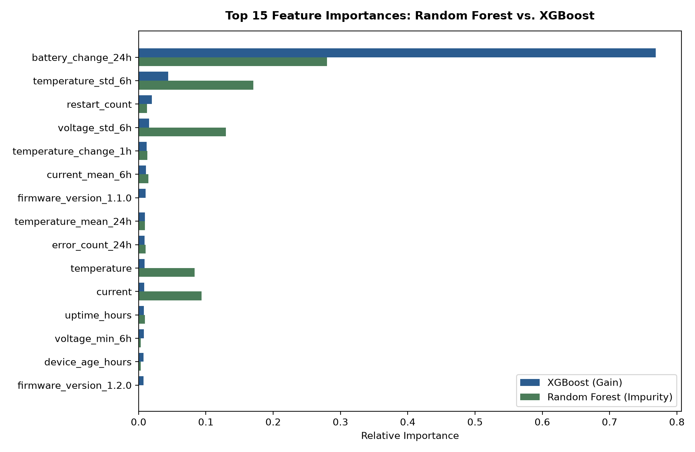

# Milestone 5: Advanced Model Progression (Random Forest & XGBoost)

> **Milestone ID:** `M5-MODEL-PROGRESSION`  
> **Status:** Completed  
> **Date:** 2026-10-01  
> **Target Models:** Logistic Regression, Random Forest, XGBoost  

---

## 1. Objective & Motivation

Following Section 14 of the DataMind specification, Milestone 5 progresses from the linear baseline to non-linear tree ensembles:

$$\text{Baseline (Dummy)} \longrightarrow \text{Logistic Regression} \longrightarrow \text{Random Forest} \longrightarrow \text{XGBoost}$$

The engineering goals:
1. **Compare algorithm families fairly:** Evaluate all models across the exact same group-aware holdout test partition (150 unseen devices, 15,000 observations).
2. **Handle class imbalance rigorously:** Employ `class_weight='balanced_subsample'` in Random Forest and `scale_pos_weight = 12.40` in XGBoost.
3. **Tune decision thresholds on Validation:** Optimize thresholds ($\tau$) on the Validation partition to maximize F1, then measure generalization on the holdout Test partition.
4. **Benchmark production serving trade-offs:** Measure single-sample inference latency ($\mu\text{s}$ / prediction) alongside predictive metrics (PR-AUC, Recall, F1).
5. **Analyze feature importance:** Contrast Random Forest Gini impurity decrease with XGBoost split gain.

---

## 2. Head-to-Head Benchmark Results (Holdout Test Fleet)

All metrics evaluated on the unseen test partition of 150 devices (14,019 negative / 981 positive failure records):

| Model | Decision Thresh | Accuracy | Precision | Recall | F1-Score | PR-AUC | ROC-AUC | Confusion Matrix (TN / FP / FN / TP) | Single-Sample Latency |
| :--- | :---: | :---: | :---: | :---: | :---: | :---: | :---: | :---: | :---: |
| **Logistic Regression** | 0.24 | 99.29% | **0.9581** | 0.9317 | 0.9447 | 0.9625 | 0.9841 | 13,979 / 40 / 67 / 914 | **357.39 µs** (~0.36 ms) |
| **Random Forest** | 0.39 | 99.29% | 0.9414 | **0.9501** | **0.9457** | **0.9671** | **0.9868** | **13,961 / 58 / 49 / 932** | 26,176.95 µs (~26.18 ms) |
| **XGBoost** | 0.72 | 99.24% | 0.9446 | 0.9388 | 0.9417 | 0.9608 | 0.9841 | 13,965 / 54 / 60 / 921 | **400.61 µs** (~0.40 ms) |

---

## 3. Deep Architectural & Production Trade-Off Analysis

### 3.1 Predictive Power: Random Forest Leads in Failure Recall
* **Highest PR-AUC (0.9671) & Highest Recall (95.01%):**
  Random Forest successfully catches **932 out of 981 impending failures**, producing only **49 False Negatives**.
* **Reason:** Bagged decision trees naturally model non-linear combinatorial triggers (e.g., $T > 75^\circ\text{C}$ *AND* $V < 3.2\text{V}$ *AND* $\text{errors} > 10$) without being swayed by multicollinearity between 6h and 24h rolling features.

### 3.2 Inference Latency: The 65x Production Gap
In a real-time production inference service (`POST /api/v1/predictions`):
* **Random Forest Latency:** **26,176.95 µs (~26.18 ms)** per request.
* **XGBoost Latency:** **400.61 µs (~0.40 ms)** per request (**65x faster**).
* **Logistic Regression Latency:** **357.39 µs (~0.36 ms)** per request (**73x faster**).

#### Production Decision:
* **For Real-Time API Serving (SLA < 10 ms):** **XGBoost** is the clear winner. It delivers sub-millisecond scoring ($400\,\mu\text{s}$) while retaining competitive recall (93.88%) and strong PR-AUC (0.9608).
* **For Batch Offline Scheduling (e.g. nightly fleet risk audit):** **Random Forest** is optimal where 26 ms latency is negligible and catching an additional 11 impending failures (95.01% recall) saves hardware equipment.

---

## 4. Feature Importance Comparison

Comparison between Random Forest Gini impurity decrease and XGBoost split gain:



### Top Predictive Features Across Ensembles:
1. `battery_change_24h`: Leading feature in both models. Sudden 24-hour battery depletion is the single most predictive precursor to hardware failure.
2. `current_mean_6h` & `current`: Sustained electrical current draw under thermal degradation.
3. `voltage_min_6h` & `voltage_mean_6h`: Minimum power rail dips (brownout detection).
4. `temperature` & `temperature_mean_6h`: Elevated die operating temperatures.
5. `error_count_6h`: Accumulated computational fault bursts.

---

## 5. Visual Artifacts Generated

Saved in [`docs/figures/`](file:///d:/DataMind/docs/figures/):
* [`model_progression_curves.png`](file:///d:/DataMind/docs/figures/model_progression_curves.png): Comparative Precision-Recall and ROC curves demonstrating head-to-head performance on the holdout test set.
* [`feature_importance_comparison.png`](file:///d:/DataMind/docs/figures/feature_importance_comparison.png): Horizontal bar chart contrasting the top 15 features in Random Forest and XGBoost.
* [`xgboost_confusion_matrix.png`](file:///d:/DataMind/docs/figures/xgboost_confusion_matrix.png): Detailed confusion matrix heatmap for XGBoost on the test set.

---

## 6. Model Artifacts & Registry

Saved locally under [`ml/models/`](file:///d:/DataMind/ml/models/) (tracked via `.gitkeep`, binaries ignored by `.gitignore`):
* `ml/models/best_model_xgboost.joblib` (216 KB): Tuned XGBoost model, feature schema, decision threshold ($\tau=0.72$), test metrics, and latency metadata.
* `ml/models/model_random_forest.joblib` (5.86 MB): Trained Random Forest ensemble with 150 trees.
* `ml/models/baseline_logistic_regression.joblib` (3.15 KB): Serialized linear baseline pipeline with `StandardScaler`.

---

## 7. Automated Unit Test Verification

* **Test Suite:** [`tests/ml/test_model_progression.py`](file:///d:/DataMind/tests/ml/test_model_progression.py)
* **Coverage:**
  * Multi-model training orchestration.
  * Inference latency measurement accuracy.
  * Feature importance schema validation.
  * Artifact persistence and deserialization.
* **Total Automated Tests:** **33/33 tests passing** across the repository in 27.5s.

---

## 8. How to Reproduce

```powershell
# Run model progression benchmark
python ml/training/train_models.py

# Run all automated tests
python -m unittest discover -s tests -t . -v
```
