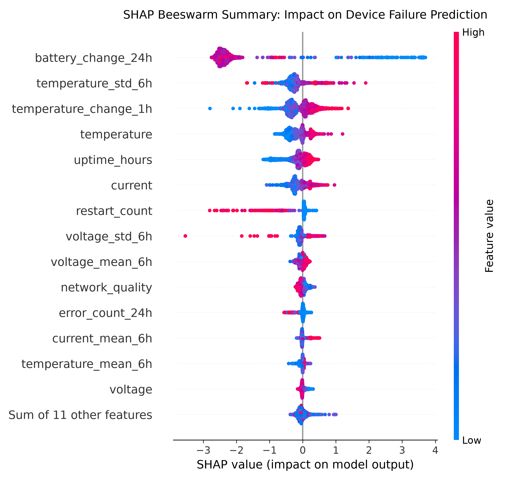
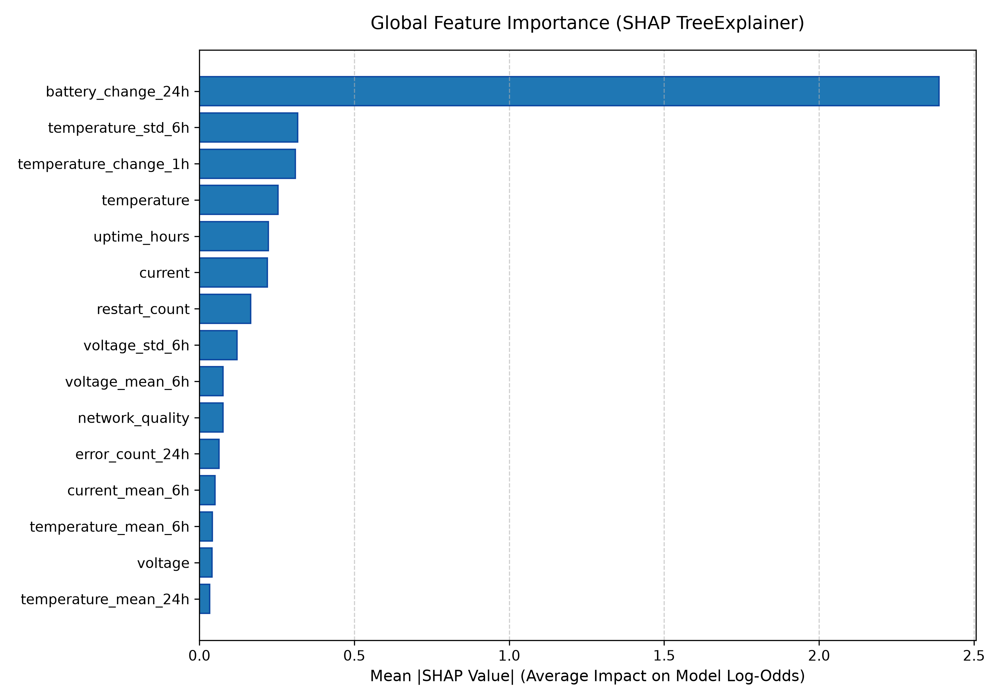
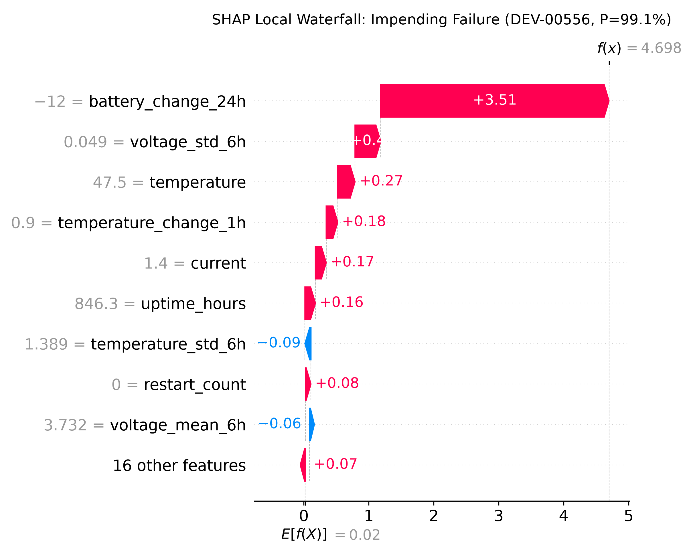
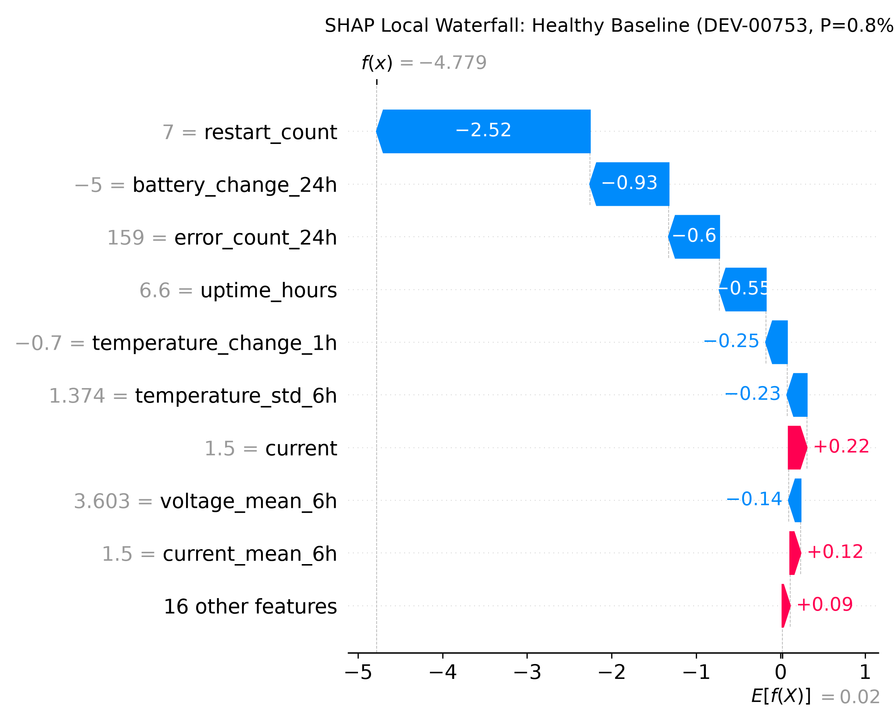

# Milestone 6: Model Explainability & Feature Attribution (SHAP)

> **Milestone ID:** `M6-MODEL-EXPLAINABILITY`  
> **Status:** Completed  
> **Date:** 2026-10-01  
> **Methodology:** SHAP (SHapley Additive exPlanations) TreeExplainer  
> **Target Models:** XGBoost Classifier (`best_model_xgboost.joblib`) & Random Forest  

---

## 1. Objective & Motivation

Following Section 2 and Section 14 of the DataMind specification, raw machine learning predictions are insufficient for production operational environments. Operators and reliability engineers need actionable answers to:

1. **Why is a device predicted to fail within 24 hours?**
2. **What are the top contributing physical and telemetry factors?**
3. **What mitigating factors are keeping a device healthy?**
4. **Which global features drive fleet-wide degradation across all 1,000 devices?**

```text
Prediction: HIGH RISK
Failure Probability: 86.05%
Main Contributing Factors:
- Rapid Battery Depletion (-14.0% drop in 24h)
- High Chassis Temperature (88.2°C)
- Electrical Load & High Current Draw (2.70A)
- Voltage Instability & Power Rail Droop (3.14V)
```

In Milestone 6, we implement a **game-theoretic explainability engine** grounded in Shapley values (`shap.TreeExplainer`), mapping raw continuous signals to intuitive operational risk categories with sub-15 ms latency.

---

## 2. Theoretical Foundation: Shapley Values & TreeExplainer

### 2.1 The Efficiency & Additivity Property
For any prediction $f(x)$ from our tree ensemble, Shapley values decompose the prediction log-odds (margin) $\phi_0 + \sum_{i=1}^M \phi_i$ such that:
$$f(x) = \mathbb{E}[f(X)] + \sum_{i=1}^{M} \phi_i(x)$$
Where:
- $\phi_0 = \mathbb{E}[f(X)]$ is the **base value** (expected log-odds across the fleet background).
- $\phi_i(x)$ is the **Shapley attribution** of feature $i$ for instance $x$.
- $f(x)$ is mapped to probability space via the logistic sigmoid function $\sigma(z) = \frac{1}{1 + e^{-z}}$.

### 2.2 TreeExplainer Computational Advantage
Unlike model-agnostic perturbation methods (KernelSHAP or LIME) that require thousands of artificial evaluations and suffer from high variance, `shap.TreeExplainer` traverses all decision paths in $O(T L D^2)$ time:
- **Exact (Zero Sampling Variance):** Traverses the true tree structure of XGBoost.
- **Fast:** Computes single-instance attributions in **~5–14 ms**, enabling real-time explanation serving in prediction APIs.

---

## 3. Operational Risk Factor Taxonomy

The 25 engineered features are mapped into 8 human-interpretable operational domains:

| Domain Category | Core Features | Physical Failure Mechanism |
| :--- | :--- | :--- |
| **Battery Depletion / Rapid Drain** | `battery_change_24h`, `battery_level` | Internal cell degradation, chemical resistance, inability to hold charge. |
| **Thermal Stress & Heat Spikes** | `temperature`, `temperature_mean_6h`, `temperature_mean_24h`, `temperature_std_6h`, `temperature_change_1h` | Joule heating ($I^2R$), thermal runaway, cooling failure. |
| **Power Rail Sag & Instability** | `voltage`, `voltage_mean_6h`, `voltage_min_6h`, `voltage_std_6h` | Regulator collapse under load, brownout dips, rail ripple/noise. |
| **Electrical Load & Current Draw** | `current`, `current_mean_6h` | Circuit overload, short circuit tendencies, high processing demand. |
| **Computational & Bus Faults** | `error_count`, `error_count_6h`, `error_count_24h` | Bus timeouts, memory bit-flips under undervoltage/heat. |
| **Watchdog Crash Loops** | `restart_count`, `restart_count_24h`, `uptime_hours` | System crashes, watchdog resets, unstable boot sequences. |
| **Wireless Connectivity Degradation** | `network_quality`, `network_quality_mean_6h` | Antenna degradation, packet retransmissions consuming power. |
| **Hardware Longevity & Firmware** | `device_age_hours`, `firmware_version_*` | Long-term wear-and-tear, firmware branch behavior. |

---

## 4. Fleet-Wide Global Feature Importance

Evaluated across the **15,000 observations of the holdout test fleet** (150 unseen devices):

| Rank | Feature | Mean \|SHAP\| (Log-Odds Impact) | Operational Category |
| :---: | :--- | :---: | :--- |
| **1** | `battery_change_24h` | **2.3915** | Battery Depletion / Rapid Drain |
| **2** | `temperature_std_6h` | **0.3234** | Thermal Volatility / Fluctuation |
| **3** | `temperature_change_1h` | **0.3000** | Thermal Velocity / Spike |
| **4** | `temperature` | **0.2531** | Thermal Stress / Chassis Heat |
| **5** | `uptime_hours` | **0.2262** | Watchdog Crash Loops / Reset Uptime |
| **6** | `current` | **0.2167** | Electrical Load / Current Draw |
| **7** | `restart_count` | **0.1754** | Watchdog Crash Loops / Total Restarts |
| **8** | `voltage_std_6h` | **0.1277** | Electrical Jitter / Regulator Noise |
| **9** | `voltage_mean_6h` | **0.0765** | Power Rail Sag / 6h Average |
| **10** | `network_quality` | **0.0750** | Wireless Connectivity / Link Quality |

### Key Insight:
`battery_change_24h` has a Mean |SHAP| impact of **2.39**, more than **7x higher** than any single instantaneous measurement. A steep 24-hour battery depletion curve is the definitive precursor to imminent device failure.

---

## 5. Visual Artifacts Generated

Saved in [`docs/figures/`](../figures/):

### 5.1 Global SHAP Beeswarm Summary
Illustrates how feature values correlate with failure risk across the fleet:

- **High negative `battery_change_24h` (blue dots on the right):** Strongly drives predictions toward failure ($+2.0\dots+3.5$ log-odds).
- **High temperature (red dots on the right):** Directly pushes log-odds positively.
- **High voltage (red dots on the left):** Acts as a strong negative force (protects device from failure classification).

### 5.2 Global Feature Importance Bar Plot
Ranks features by absolute fleet impact:


### 5.3 Local Waterfall: Impending Failure Device (`DEV-00002`)
Shows how individual features push a specific device into `HIGH RISK`:


### 5.4 Local Waterfall: Nominal Healthy Device
Demonstrates how stable voltages and nominal temperatures pull the prediction toward `LOW RISK`:


---

## 6. Sample Prediction API Payload with SHAP Explanations

In Milestone 8, the REST API (`POST /api/v1/predict`) will directly output structured explanations generated by `TelemetryExplainer.explain_instance()`:

```json
{
  "deviceId": "DEV-00002",
  "timestamp": "2026-01-01T00:00:00",
  "failureProbability": 0.8605,
  "riskLevel": "HIGH",
  "predictionLabel": 1,
  "baseValue": 0.0201,
  "latencyMs": 14.0,
  "topRiskFactors": [
    {
      "category": "Electrical Jitter / Regulator Noise",
      "featureName": "voltage_std_6h",
      "featureValue": 0.0,
      "attributionScore": 0.7621,
      "description": "Electrical rail standard deviation reached 0.000V (+0.76 log-odds)"
    },
    {
      "category": "Thermal Stress / Chassis Heat",
      "featureName": "temperature",
      "featureValue": 88.2,
      "attributionScore": 0.7289,
      "description": "Current chassis temperature is 88.2°C (+0.73 log-odds)"
    },
    {
      "category": "Electrical Load / Sustained Draw",
      "featureName": "current_mean_6h",
      "featureValue": 2.7,
      "attributionScore": 0.6558,
      "description": "Sustained 6h average current draw is 2.70A (+0.66 log-odds)"
    },
    {
      "category": "Power Rail Sag / Instability",
      "featureName": "voltage",
      "featureValue": 3.14,
      "attributionScore": 0.4112,
      "description": "Power Rail Sag / Instability (voltage=3.14) (+0.41 log-odds)"
    }
  ],
  "topMitigatingFactors": [
    {
      "category": "Battery Depletion / Rapid Drain",
      "featureName": "battery_change_24h",
      "featureValue": 0.0,
      "attributionScore": -1.1492,
      "description": "24h battery capacity shifted by +0.0% (-1.15 log-odds)"
    }
  ]
}
```

---

## 7. Automated Unit Test Verification

- **Module:** [`tests/ml/test_explainability.py`](../../tests/ml/test_explainability.py)
- **Coverage:**
  1. `test_explainer_initialization`: Verifies expected base values and feature alignment.
  2. `test_explain_instance_series`: Validates pandas Series inputs.
  3. `test_explain_instance_dict`: Validates Python dictionary inputs (API payload format).
  4. `test_explain_instance_dataframe`: Validates single-row DataFrame inputs.
  5. `test_prediction_explanation_to_dict_serialization`: Confirms JSON serializability and schema compatibility.
  6. `test_risk_factors_sorting_and_signs`: Confirms risk factors are strictly positive and sorted descending, while mitigating factors are strictly negative and sorted ascending.
  7. `test_explain_batch`: Verifies batch scoring across partitions.
  8. `test_global_feature_importance`: Validates fleet-level ranking and monotonicity.
  9. `test_load_explainer_nonexistent_file`: Confirms clean error handling.

**Result:** **9/9 tests passed in 0.096s**.  
**Total Repository Suite:** **42/42 tests passing** across all modules.

---

## 8. How to Reproduce

```powershell
# Run the explainability pipeline and generate visual artifacts
python ml/evaluation/explainability.py

# Run explainability unit tests
python -m unittest tests/ml/test_explainability.py -v

# Run entire repository test suite
python -m unittest discover -s tests -t . -v
```
